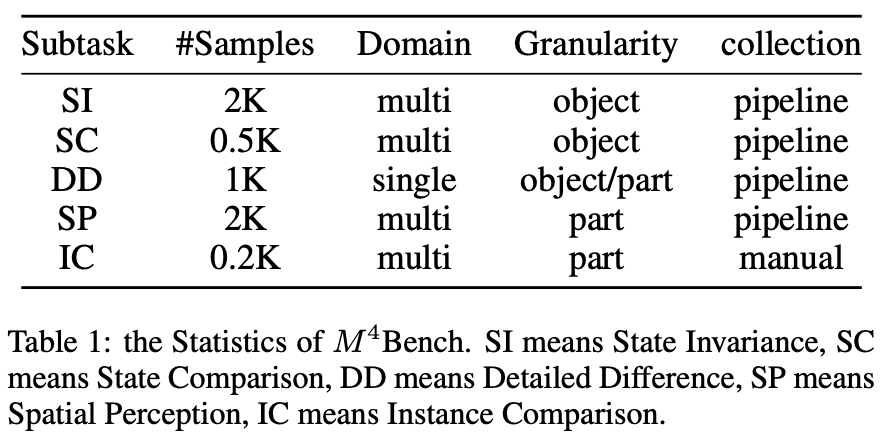
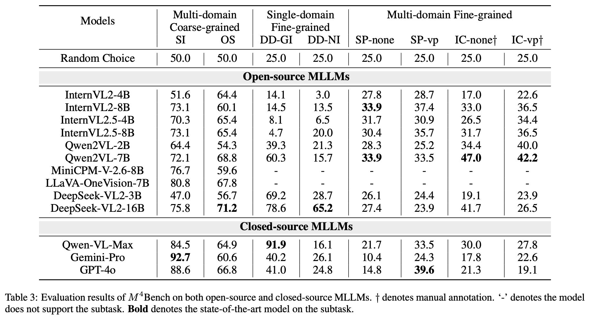
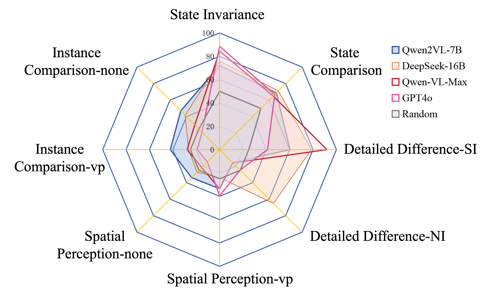

#  $M^4$ Bench
[](https://huggingface.co/datasets/Anonymous8976/M4Bench) 


## Introduction
The increasing demands in analyzing complex associated scenes pose necessities to researching multi-image understanding abilities. 
Compared with understanding individual images, both the alignments and differences between images are essential aspects of understanding the intricate relationships for multi-image inference tasks. 
However, existing benchmarks face difficulties in addressing both of these aspects simultaneously, resulting in obstacles to modeling relationships under various granularities and domains of images. 
In this paper, we introduce a benchmark called $M^4$ Bench to enhance the capability of aligning and distinguishing multi-images with multi-domain multi-granularity comparison. 
We carefully design five comparison tasks related to coarse and fine-grained granularities in single and multiple domains of images and evaluate them on 13 state-of-the-art multi-modal large language models with various sizes. 
Besides, we analyze the evaluation results and provide several observations and viewpoints for the multi-image understanding research.


## 📰 News
* **[2025.8.11]** 🔥 $M^4$ Bench is supported by [open-compass/VLMEvalKit](https://github.com/open-compass/VLMEvalKit) in [PR #1163](https://github.com/open-compass/VLMEvalKit/pull/1163)
* **[2025.4.29]** 🔥 $M^4$ Bench has been accepted to IJCAI2025!
* **[2025.4.9]**  🔥We release the evaluation code and outputs of $M^4$ Bench.
* **[2025.2.10]**  🔥We release the [M4Bench](https://huggingface.co/datasets/Anonymous8976/M4Bench) on HuggingFace.


## Dataset 🌟
**$M^4$ Bench**: 🤗[Hugging Face](https://huggingface.co/datasets/Anonymous8976/M4Bench)

**We have provided both versions of the dataset on Hugging Face:**
1. the current path-based naming scheme;
2. a neutral image filenames (e.g., “img1_1”, “img1_2”) in one folder.


**$M^4$ Bench-v1**


We utilize our designed automated dataset construction pipeline to expand the scale of $M^4$ Bench, presenting $M^4$ Bench-v2.

**$M^4$ Bench-v2**


## 🚀 Quickstart
### Step 1. Installation
> [!TIP] 
> Since different MLLMs may require different versions of `transformers` and `other dependencies`, we recommend creating **a separate virtual environment** for each model series (e.g., Qwen Series) to avoid dependency conflicts.
```bash
conda create -n m4bench python=3.10 -y
# git clone this repo
cd M4Bench
pip install -r requirements.txt
```
### Step 2. LLM Judge
Our evaluation code supports API models (like the GPT series or any other models accessible via the OpenAI API) as a judge. The only thing you need to do is to set the environment variable `OPENAI_API_KEY` like blew.
> [!IMPORTANT]
> If you don't set the variable, the evaluation will default to using `exact match` as the assessment method
```bash
export OPENAI_API_KEY=your_api_key
```
### Step 3. Model & Dataset
You can download the models and datasets from the huggingface, and put them in the `llm` and `dataset` folder respectively.
```bash
mkdir llm # for example, llm/Qwen/Qwen2-VL-2B-Instruct
mkdir dataset
```
We have implemented **10 open-source models** in our benchmark, as shown in the table below.
| Model Name       | Supports Multiple Images | Supports Grounding | Model Name       | Supports Multiple Images | Supports Grounding |
|------------------|---------------------------|--------------------|------------------|---------------------------|--------------------|
| Qwen2-VL-2B-Instruct     |   ✅                       | ✅                | Qwen2-VL-7B-Instruct             | ✅                         | ✅          |
| InternVL2-4B     |   ✅                       | ✅                | InternVL2-8B            | ✅                         | ✅          |
| InternVL2.5-4B     |   ✅                       | ✅                | InternVL2.5-8B            | ✅                         | ✅          |
| deepseek-vl2-tiny     |   ✅                       | ✅                | deepseek-vl2-small            | ✅                         | ✅          |
| MiniCPM-V-2_6     |   ✅                       | ❌                | llava-onevision            | ✅                         | ❌          |
> [!IMPORTANT]
> If you have downloaded the models, you need to modify the `model_mapping` in `main.py` to point to the correct paths.
### Step 4. Evaluate
Now, you can start the evaluation process by running the following command:
- model_name: `model_mapping` variable in `main.py`
- task_list: `task_mapping` variable in `main.py`, separated by commas
```bash
# Run a model with multiple tasks in parallel
python main.py \
  --model_name Qwen2-VL-7B-Instruct \
  --task_list Object_States,State_Invariance
```
### Step 5. Development
If you want to add new model to be evaluated on our benchmark, you can follow the following steps:
1. please refer to `utils.models.deepseekvl2.py` and implement your model with key functions `__init__`, `parse_input` and `infer` in a new python file in the `utils.models` directory.
2. please modify the `utils.models.automodel.py` and add your model in the `from_pretrained` function according to the model type in its own config.
3. please modify the `main.py` to add your model in the `model_mapping` variable.
4. Now you can enjoy the evaluation simply by running the following command:
```bash
python main.py \
  --model_name Your_Model_Name \
  --task_list TaskName
```

### Use VLMEvalKit

```bash
git clone https://github.com/open-compass/VLMEvalKit.git
cd VLMEvalKit
pip install -e .

# Example
python3 run.py --data Instance_Comparison --model QwenVLPlus --verbose
python3 run.py --data M4Bench --model QwenVLPlus --verbose
```

## Evaluation

Please refer to our [outputs](outputs) folder for more details.




## 🏆 Mini-Leaderboard
| Model                      |     Test    | 
|----------------------------|:-----------:|
|🏅 DeepSeek-VL2-small       |     51.3    | 
|🥈 Qwen2VL-7B               |     46.7    |  
|🥉 Qwen-VL-Max              |     46.3    |  
| GPT-4o                     |     39.5    |  
| Qwen2VL-2B                 |     38.4    | 
| InternVL2-8B               |     37.8    | 
| InternVL2.5-8B             |     37.2    | 
| DeepSeek-VL2-tiny          |     36.9    |  
| Gemini 1.5 Pro             |     36.8    | 
| InternVL2.5-4B             |     34.2    | 
| InternVL2-4B               |     28.7    |  
| LLaVA-OneVision            |     18.6    | 
| MiniCPM-V2.6-8B            |     17.0    | 
